# Задание 1

КиноБездна - это платформа для стриминга фильмов, которая проходит процесс миграции от монолитной архитектуры к микросервисной с использованием паттерна Strangler Fig и Event-Driven Architecture (EDA).

## Текущая архитектура (As-Is)

### Описание

Текущая система представляет собой монолитное приложение на Go, которое обрабатывает все бизнес-процессы:

- **Управление пользователями**: регистрация, аутентификация, профили
- **Метаданные фильмов**: каталог фильмов, рейтинги, жанры
- **Платежи**: обработка транзакций, история платежей
- **Подписки**: управление подписками пользователей

### Внешние интеграции

Система взаимодействует с несколькими внешними системами:

- **Платежная система**: Внешняя система для обработки платежей и транзакций через REST API
- **Рекомендательная система**: Внешняя система для генерации персональных рекомендаций через REST API
- **Онлайн-кинотеатры**: Интеграция с внешними кинотеатрами для получения контента через REST API
- **S3**: Объектное хранилище для BLOBs (постеры фильмов, видео-контент, изображения)

### Технологический стек

- **Язык программирования**: Go
- **База данных**: PostgreSQL
- **Объектное хранилище**: S3
- **Протокол взаимодействия**: REST API, S3 API

### Особенности

- Все компоненты тесно связаны в едином приложении
- Единая база данных для всех доменов
- Хранение BLOBs вынесено в S3 для оптимизации
- Интеграция с внешними системами через REST API
- Простота развертывания и разработки
- Ограниченная масштабируемость
- Сложность независимого обновления компонентов

### Контейнерная диаграмма C4 (As-Is)
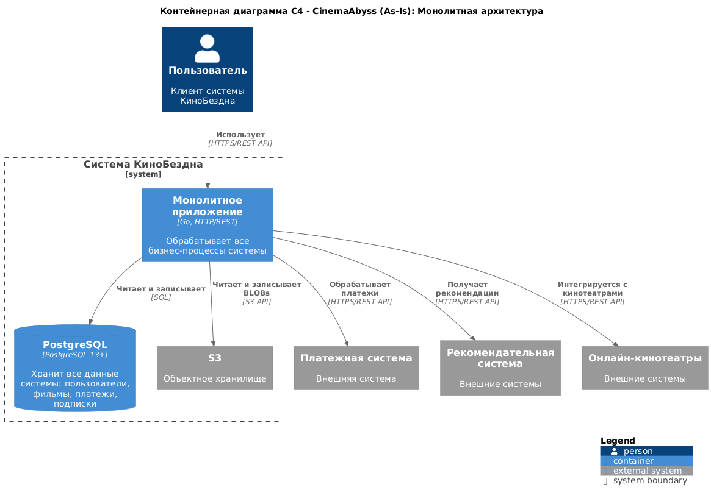

[Диаграмма в PlantUML](schemas/as-is-architecture.puml)

## Целевая архитектура (To-Be)

### Описание

Целевая архитектура представляет собой микросервисную систему с использованием паттерна Strangler Fig для постепенной миграции и Event-Driven Architecture (EDA) для асинхронной коммуникации между сервисами.

Система разделена на следующие домены:

#### 1. User Domain (Домен пользователей)
- **Ответственность**: Управление пользователями, аутентификация, авторизация
- **Статус**: В монолите (планируется миграция)
- **Данные**: Профили пользователей, учетные данные

#### 2. Movie Domain (Домен фильмов)
- **Ответственность**: Метаданные фильмов, рейтинги, жанры, каталог
- **Статус**: Выделен в микросервис Movies Service
- **Данные**: Фильмы, жанры, рейтинги

#### 3. Payment Domain (Домен платежей)
- **Ответственность**: Обработка платежей, транзакции, история
- **Статус**: В монолите (планируется миграция)
- **Данные**: Платежи, транзакции

#### 4. Subscription Domain (Домен подписок)
- **Ответственность**: Управление подписками, тарифные планы
- **Статус**: В монолите (планируется миграция)
- **Данные**: Подписки, тарифы

#### 5. Event Domain (Домен событий)
- **Ответственность**: Обработка событий системы, интеграция между сервисами
- **Статус**: Выделен в микросервис Events Service
- **Данные**: События (Movie, User, Payment)

### Преимущества целевой архитектуры

- **Масштабируемость**: Независимое масштабирование сервисов
- **Гибкость**: Независимое развертывание и обновление
- **Отказоустойчивость**: Изоляция сбоев в отдельных сервисах
- **Производительность**: Оптимизация каждого сервиса под свою задачу
- **Командная работа**: Разные команды могут работать над разными сервисами
- **Технологическое разнообразие**: Возможность использовать разные технологии

### Компоненты системы

#### Proxy Service (API Gateway)
- **Назначение**: Единая точка входа в систему
- **Функции**:
  - Маршрутизация запросов между монолитом и микросервисами
  - Реализация паттерна Strangler Fig
  - Процентное распределение трафика (feature flag)
  - Фасад для всей системы

#### Monolith (Legacy)
- **Назначение**: Обработка доменов, еще не мигрированных в микросервисы
- **Функции**:
  - Управление пользователями
  - Обработка платежей (интеграция с внешней платежной системой)
  - Управление подписками
  - Интеграция с рекомендательной системой
  - Интеграция с онлайн-кинотеатрами
  - Управление BLOBs в S3
  - Постепенная миграция функциональности

#### Movies Service
- **Назначение**: Обработка всего функционала, связанного с фильмами
- **Функции**:
  - CRUD операции с фильмами
  - Управление жанрами
  - Рейтинги фильмов
  - Каталог фильмов
  - Управление постерами и изображениями (S3)
  - Интеграция с рекомендательной системой
  - Интеграция с онлайн-кинотеатрами

#### Events Service
- **Назначение**: Обработка событий системы через Kafka
- **Функции**:
  - Публикация событий (Producer)
  - Обработка событий (Consumer)
  - Типы событий:
    - Movie Events (просмотр, оценка, добавление)
    - User Events (регистрация, вход)
    - Payment Events (успешные, неудачные)

### Внешние системы

#### Платежная система
- **Назначение**: Обработка платежей и транзакций
- **Протокол**: HTTPS/REST API
- **Интеграция**: Через Monolith (планируется миграция в отдельный сервис)

#### Рекомендательная система
- **Назначение**: Генерация персональных рекомендаций для пользователей
- **Протокол**: HTTPS/REST API
- **Интеграция**: Через Monolith и Movies Service

#### Онлайн-кинотеатры
- **Назначение**: Получение контента из внешних кинотеатров
- **Протокол**: HTTPS/REST API
- **Интеграция**: Через Monolith и Movies Service

### Инфраструктура

#### PostgreSQL
- **Назначение**: Хранилище данных
- **Схема**: Единая база данных для всех сервисов (на этапе миграции)
- **Таблицы**: users, movies, movie_genres, payments, subscriptions, views, user_ratings

#### S3
- **Назначение**: Объектное хранилище для BLOBs
- **Использование**: Хранение больших файлов (постеры фильмов, видео-контент, изображения)
- **Преимущества**: Масштабируемость, надежность, оптимизация хранения

#### Apache Kafka
- **Назначение**: Event Streaming Platform
- **Топики**:
  - `movie-events`: события, связанные с фильмами
  - `user-events`: события, связанные с пользователями
  - `payment-events`: события, связанные с платежами
- **Конфигурация**: 1 партиция, replication factor 1 (для разработки)

#### Zookeeper
- **Назначение**: Координация Kafka кластера
- **Функции**: Управление метаданными, координация брокеров

**Внешние системы:**

- **Платежная система**: Интеграция через Monolith для обработки платежей
- **Рекомендательная система**: Интеграция через Monolith и Movies Service для получения рекомендаций
- **Онлайн-кинотеатры**: Интеграция через Monolith и Movies Service для получения контента

### Паттерны и подходы

#### Strangler Fig Pattern
- **Реализация**: Через Proxy Service
- **Механизм**: Процентное распределение трафика между монолитом и микросервисами
- **Преимущества**: Постепенная миграция без остановки системы

#### Event-Driven Architecture (EDA)
- **Реализация**: Через Kafka и Events Service
- **Механизм**: Асинхронная коммуникация через события
- **Преимущества**: Слабая связанность, масштабируемость, отказоустойчивость

#### API Gateway Pattern
- **Реализация**: Proxy Service
- **Функции**: Единая точка входа, маршрутизация, возможно кэширование и rate limiting

### Технологический стек

#### Backend
- **Языки**: Go (монолит, movies), Python (events, proxy)
- **Протоколы**: HTTP/REST, Kafka

#### База данных
- **СУБД**: PostgreSQL 13+
- **ORM/Драйверы**: lib/pq (Go)

#### Message Broker
- **Платформа**: Apache Kafka 2.7+
- **Координатор**: Apache Zookeeper 3.6+

#### Инфраструктура
- **Контейнеризация**: Docker
- **Оркестрация**: Kubernetes, Docker Compose
- **CI/CD**: GitHub Actions
- **Управление конфигурацией**: Helm Charts
- **Объектное хранилище**: S3

### Контейнерная диаграмма C4 (To-Be)
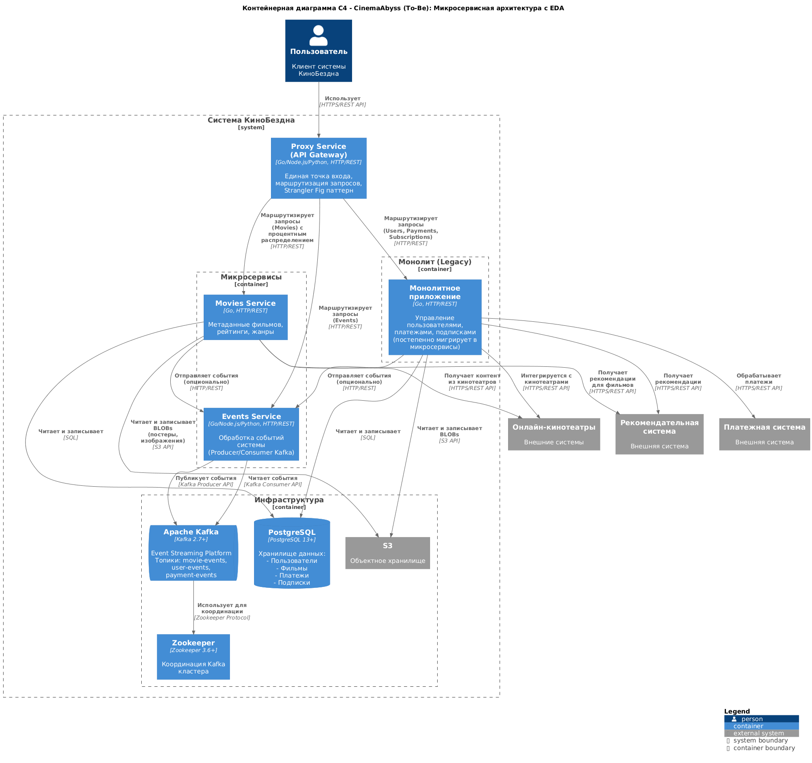

[Диаграмма PlantUML](schemas/to-be-architecture.puml)

# Задание 2

## Реализация Proxy Service

**Архитектура:**
Прокси-сервис реализован как API Gateway на базе FastAPI, который обеспечивает единую точку входа в систему и реализует паттерн Strangler Fig для постепенной миграции функциональности из монолита в микросервисы.

**Технологии:**
- Python 3.11
- FastAPI 0.104.1
- Uvicorn 0.24.0
- HTTPX 0.25.2

### Основные функции

1. **Маршрутизация запросов к movies с паттерном Strangler Fig:**
   - Запросы к `/api/movies` распределяются между монолитом и микросервисом `movies-service` на основе процента миграции
   - Процент миграции задается через переменную окружения `MOVIES_MIGRATION_PERCENT` (0-100)
   - Используется случайное распределение для равномерного распределения нагрузки
   - Фича-флаг `GRADUAL_MIGRATION` позволяет включать/выключать постепенную миграцию

2. **Проксирование запросов к микросервису events:**
   - Все запросы к `/api/events/*` направляются в `events-service`
   - Поддержка всех HTTP методов (GET, POST, PUT, DELETE, PATCH)

3. **Проксирование запросов к монолиту:**
   - Все остальные запросы к `/api/*` (users, payments, subscriptions) направляются в монолит
   - Сохранение всех заголовков и параметров запроса

4. **Health check endpoints:**
   - `/health` - проверка работоспособности самого прокси-сервиса
   - Проксирование health check эндпоинтов микросервисов

### Особенности реализации
- Асинхронная обработка запросов для высокой производительности
- Сохранение всех заголовков и параметров запроса при проксировании
- Обработка ошибок с возвратом статуса 503 при недоступности целевого сервиса
- Логирование всех проксируемых запросов для мониторинга
- Поддержка всех HTTP методов и query параметров

### Конфигурация
- `PORT` - порт для запуска сервиса (по умолчанию 8000)
- `MONOLITH_URL` - URL монолитного приложения
- `MOVIES_SERVICE_URL` - URL микросервиса фильмов
- `EVENTS_SERVICE_URL` - URL микросервиса событий
- `GRADUAL_MIGRATION` - включение/выключение постепенной миграции ("true"/"false")
- `MOVIES_MIGRATION_PERCENT` - процент запросов, направляемых в микросервис (0-100)

### Реализация Events Service
Сервис events реализован на Python с использованием FastAPI и kafka-python. Сервис обеспечивает асинхронную обработку событий через Apache Kafka.

#### Технологии
- Python 3.11
- FastAPI 0.104.1
- Uvicorn 0.24.0
- kafka-python 2.0.2
- Pydantic 2.5.0

#### Основные функции

1. **Kafka Producer:**
   - Публикация событий в соответствующие топики Kafka
   - Поддержка трех типов событий: Movie, User, Payment
   - Автоматическая сериализация данных в JSON
   - Надежная доставка сообщений (acks='all', retries=3)

2. **Kafka Consumer:**
   - Асинхронная обработка событий из топиков Kafka
   - Три независимых consumer'а для каждого типа событий:
     - `movie-events-consumer-group` для событий фильмов
     - `user-events-consumer-group` для событий пользователей
     - `payment-events-consumer-group` для событий платежей
   - Автоматическое логирование всех обработанных событий

3. **REST API эндпоинты:**
   - `GET /api/events/health` - проверка работоспособности сервиса
   - `POST /api/events/movie` - создание события фильма (просмотр, оценка, добавление)
   - `POST /api/events/user` - создание события пользователя (регистрация, вход)
   - `POST /api/events/payment` - создание события платежа (успешные, неудачные)

4. **Обработка событий:**
   - Автоматическое добавление timestamp при отсутствии
   - Детальное логирование всех событий с информацией о partition и offset
   - Обработка ошибок с возвратом соответствующих HTTP статусов

5. **Топики Kafka:**
- `movie-events` - события, связанные с фильмами
- `user-events` - события, связанные с пользователями
- `payment-events` - события, связанные с платежами

#### Особенности реализации
- Глобальный producer для эффективного использования ресурсов
- Валидация данных через Pydantic модели
- Подробное логирование для мониторинга и отладки
- Graceful shutdown с корректным закрытием соединений

#### Структура событий

Movie Event:
```json
{
  "movie_id": 1,
  "title": "Test Movie",
  "action": "viewed",
  "user_id": 1,
  "timestamp": "2024-01-01T12:00:00"
}
```

User Event:
```json
{
  "user_id": 1,
  "username": "testuser",
  "action": "logged_in",
  "timestamp": "2024-01-01T12:00:00"
}
```

Payment Event:
```json
{
  "payment_id": 1,
  "user_id": 1,
  "amount": 9.99,
  "status": "completed",
  "timestamp": "2024-01-01T12:00:00",
  "method_type": "credit_card"
}
```

### Cкриншот тестов
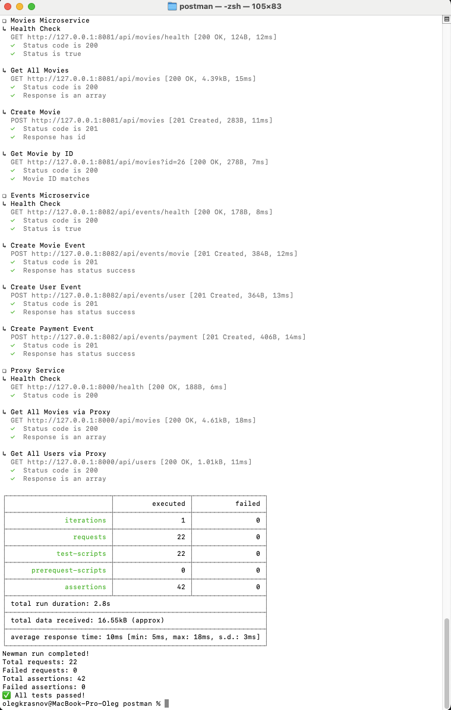

### Cкриншот состояния топиков Kafka из UI
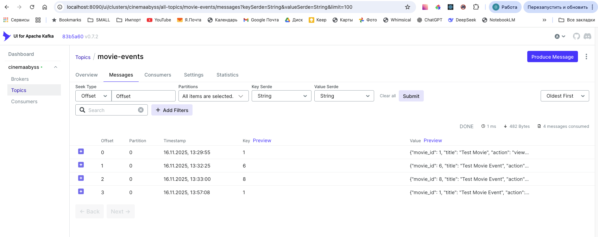

# Задание 3

Команда начала переезд в Kubernetes для лучшего масштабирования и повышения надежности. 
Вам, как архитектору осталось самое сложное:
 - реализовать CI/CD для сборки прокси сервиса
 - реализовать необходимые конфигурационные файлы для переключения трафика.


### CI/CD

#### Выполненные изменения
1) Доработаны триггеры в секции on:
- Добавлена поддержка всех веток ('**') в дополнение к main
- Workflow запускается при отправке коммита в любую ветку (включая новые)
2) Добавлены шаги для сборки Events Service:
- Extract metadata для Events Service
- Build and push Events Service Docker image
3) Добавлены шаги для сборки Proxy Service:
- Extract metadata для Proxy Service
- Build and push Proxy Service Docker image
4) Добавлен job для API тестов:
- Job api-tests запускается после успешной сборки всех образов (needs: build-and-push)
- Запускает сервисы через Docker Compose
- Выполняет API тесты через Newman
- Останавливает сервисы после завершения тестов

#### Подтверждение результатов
1) Docker Build and Push

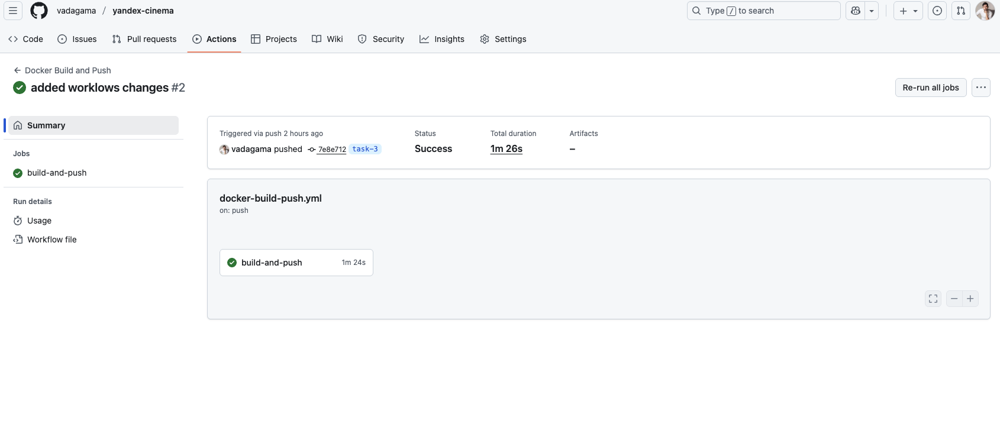

2) API Tests

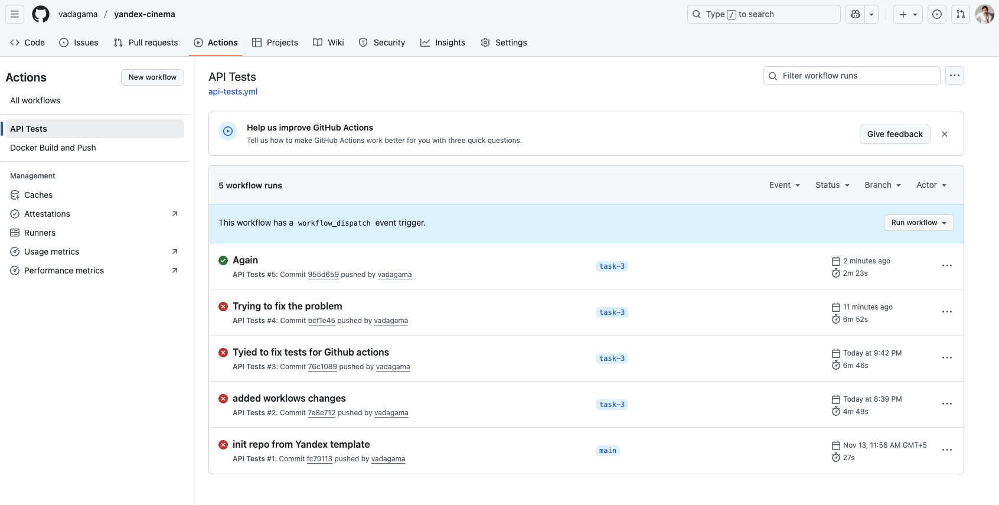


### Proxy в Kubernetes

#### Шаг 1

Реализовал CI/CD для сборки прокси-сервиса

#### Шаг 2

Создал кластер K8S и развернул все необходимые сервисы.

1) Поды в K8S:

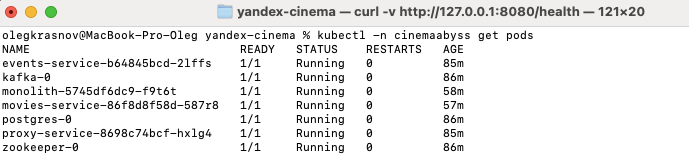

2) Работа API:

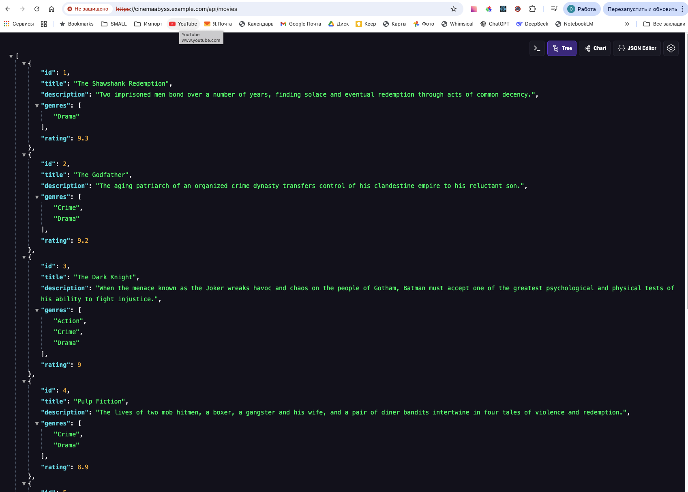

3) Результат прогона тестов для кластера K8S:

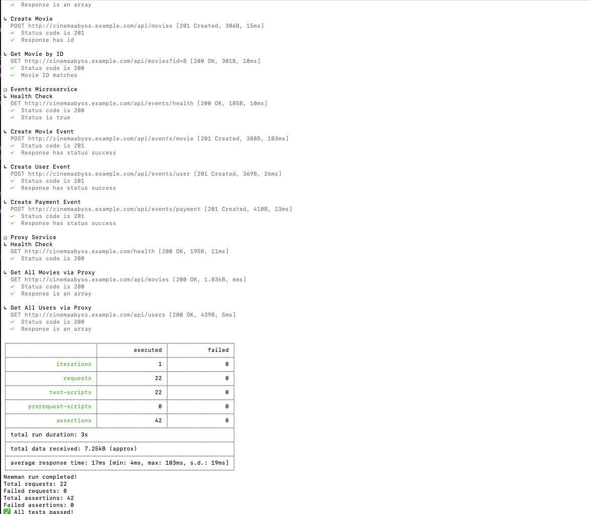


# Задание 4
Для простоты дальнейшего обновления и развертывания вам как архитектуру необходимо так же реализовать helm-чарты для прокси-сервиса и проверить работу 

1) Развернутые сервисы через Helm:

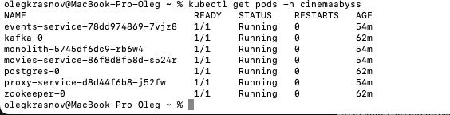

2) Работа API:

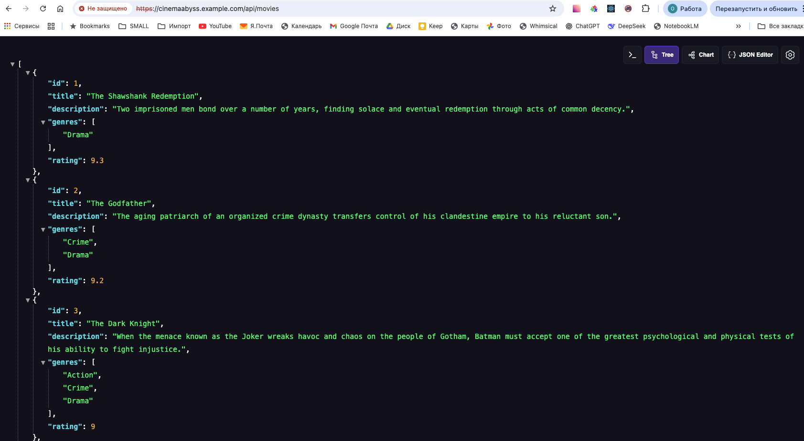

# Задание 5
Компания планирует активно развиваться и для повышения надежности, безопасности, реализации сетевых паттернов типа Circuit Breaker и канареечного деплоя вам как архитектору необходимо развернуть istio и настроить circuit breaker для monolith и movies сервисов.

```bash

helm repo add istio https://istio-release.storage.googleapis.com/charts
helm repo update

helm install istio-base istio/base -n istio-system --set defaultRevision=default --create-namespace
helm install istio-ingressgateway istio/gateway -n istio-system
helm install istiod istio/istiod -n istio-system --wait

helm install cinemaabyss .\src\kubernetes\helm --namespace cinemaabyss --create-namespace

kubectl label namespace cinemaabyss istio-injection=enabled --overwrite

kubectl get namespace -L istio-injection

kubectl apply -f .\src\kubernetes\circuit-breaker-config.yaml -n cinemaabyss

```

Тестирование

# fortio
```bash
kubectl apply -f https://raw.githubusercontent.com/istio/istio/release-1.25/samples/httpbin/sample-client/fortio-deploy.yaml -n cinemaabyss
```

# Get the fortio pod name
```bash
FORTIO_POD=$(kubectl get pod -n cinemaabyss | grep fortio | awk '{print $1}')

kubectl exec -n cinemaabyss $FORTIO_POD -c fortio -- fortio load -c 50 -qps 0 -n 500 -loglevel Warning http://movies-service:8081/api/movies
```
Например,

```bash
kubectl exec -n cinemaabyss fortio-deploy-b6757cbbb-7c9qg  -c fortio -- fortio load -c 50 -qps 0 -n 500 -loglevel Warning http://movies-service:8081/api/movies
```

Вывод будет типа такого

```bash
IP addresses distribution:
10.106.113.46:8081: 421
Code 200 : 79 (15.8 %)
Code 500 : 22 (4.4 %)
Code 503 : 399 (79.8 %)
```
Можно еще проверить статистику

```bash
kubectl exec -n cinemaabyss fortio-deploy-b6757cbbb-7c9qg -c istio-proxy -- pilot-agent request GET stats | grep movies-service | grep pending
```

И там смотрим 

```bash
cluster.outbound|8081||movies-service.cinemaabyss.svc.cluster.local;.upstream_rq_pending_total: 311 - столько раз срабатывал circuit breaker
You can see 21 for the upstream_rq_pending_overflow value which means 21 calls so far have been flagged for circuit breaking.
```

Приложите скриншот работы circuit breaker'а

Удаляем все
```bash
istioctl uninstall --purge
kubectl delete namespace istio-system
kubectl delete all --all -n cinemaabyss
kubectl delete namespace cinemaabyss
```
